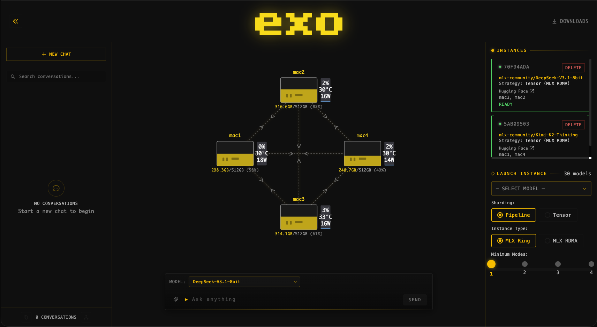

<div align="center">

<picture>
  <source media="(prefers-color-scheme: light)" srcset="/docs/imgs/exo-logo-black-bg.jpg">
  
</picture>

exo: Run frontier AI locally. Maintained by [exo labs](https://x.com/exolabs).

<p align="center">
  <a href="https://discord.gg/TJ4P57arEm" target="_blank" rel="noopener noreferrer"></a>
  <a href="https://x.com/exolabs" target="_blank" rel="noopener noreferrer"></a>
  <a href="https://www.apache.org/licenses/LICENSE-2.0.html" target="_blank" rel="noopener noreferrer"></a>
</p>

</div>

---

exo connects all your devices into an AI cluster. Not only does exo enable running models larger than would fit on a single device, but with [day-0 support for RDMA over Thunderbolt](https://x.com/exolabs/status/2001817749744476256?s=20), makes models run faster as you add more devices.

## Features

- **Automatic Device Discovery**: Devices running exo automatically discover each other - no manual configuration.
- **RDMA over Thunderbolt**: exo ships with [day-0 support for RDMA over Thunderbolt 5](https://x.com/exolabs/status/2001817749744476256?s=20), enabling 99% reduction in latency between devices.
- **Topology-Aware Auto Parallel**: exo figures out the best way to split your model across all available devices based on a realtime view of your device topology. It takes into account device resources and network latency/bandwidth between each link.
- **Tensor Parallelism**: exo supports sharding models, for up to 1.8x speedup on 2 devices and 3.2x speedup on 4 devices.
- **MLX Support**: exo uses [MLX](https://github.com/ml-explore/mlx) as an inference backend and [MLX distributed](https://ml-explore.github.io/mlx/build/html/usage/distributed.html) for distributed communication.
- **Multiple API Compatibility**: Compatible with OpenAI Chat Completions API, Claude Messages API, OpenAI Responses API, and Ollama API - use your existing tools and clients.
- **Custom Model Support**: Load custom models from HuggingFace hub to expand the range of available models.

## Dashboard

exo includes a built-in dashboard for managing your cluster and chatting with models.

<p align="center">
  
</p>
<p align="center"><em>4 × 512GB M3 Ultra Mac Studio running DeepSeek v3.1 (8-bit) and Kimi-K2-Thinking (4-bit)</em></p>

## Benchmarks

<details>
  <summary>Qwen3-235B (8-bit) on 4 × M3 Ultra Mac Studio with Tensor Parallel RDMA</summary>
  
  <p>
    <strong>Source:</strong> <a href="https://www.jeffgeerling.com/blog/2025/15-tb-vram-on-mac-studio-rdma-over-thunderbolt-5">Jeff Geerling: 15 TB VRAM on Mac Studio – RDMA over Thunderbolt 5</a>
  </p>
</details>

<details>
  <summary>DeepSeek v3.1 671B (8-bit) on 4 × M3 Ultra Mac Studio with Tensor Parallel RDMA</summary>
  
  <p>
    <strong>Source:</strong> <a href="https://www.jeffgeerling.com/blog/2025/15-tb-vram-on-mac-studio-rdma-over-thunderbolt-5">Jeff Geerling: 15 TB VRAM on Mac Studio – RDMA over Thunderbolt 5</a>
  </p>
</details>

<details>
  <summary>Kimi K2 Thinking (native 4-bit) on 4 × M3 Ultra Mac Studio with Tensor Parallel RDMA</summary>
  
  <p>
    <strong>Source:</strong> <a href="https://www.jeffgeerling.com/blog/2025/15-tb-vram-on-mac-studio-rdma-over-thunderbolt-5">Jeff Geerling: 15 TB VRAM on Mac Studio – RDMA over Thunderbolt 5</a>
  </p>
</details>

---

## Quick Start

Devices running exo automatically discover each other, without needing any manual configuration. Each device provides an API and a dashboard for interacting with your cluster (runs at `http://localhost:52415`).

There are two ways to run exo:

### Run from Source (macOS)

If you have [Nix](https://nixos.org/) installed, you can skip most of the steps below and run exo directly:

```bash
nix run .#exo
```

**Note:** To accept the Cachix binary cache (and avoid the Xcode Metal ToolChain), add to `/etc/nix/nix.conf`:
```
trusted-users = root    (or your username)
experimental-features = nix-command flakes
```
Then restart the Nix daemon: `sudo launchctl kickstart -k system/org.nixos.nix-daemon`

**Prerequisites:**
- [Xcode](https://developer.apple.com/xcode/) (provides the Metal ToolChain required for MLX compilation)
- [brew](https://github.com/Homebrew/brew) (for simple package management on macOS)

  ```bash
  /bin/bash -c "$(curl -fsSL https://raw.githubusercontent.com/Homebrew/install/HEAD/install.sh)"
  ```
- [uv](https://github.com/astral-sh/uv) (for Python dependency management)
- [node](https://github.com/nodejs/node) (for building the dashboard)

  ```bash
  brew install uv node
  ```
- [rust](https://github.com/rust-lang/rustup) (to build Rust bindings, nightly for now)

  ```bash
  curl --proto '=https' --tlsv1.2 -sSf https://sh.rustup.rs | sh
  rustup toolchain install nightly
  ```
- [macmon](https://github.com/vladkens/macmon) (for hardware monitoring on Apple Silicon)

  Install the pinned fork revision used by this repo instead of Homebrew `macmon`.
  Homebrew `macmon 0.6.1` still crashes on Apple M5.

  ```bash
  cargo install --git https://github.com/vladkens/macmon \
    --rev a1cd06b6cc0d5e61db24fd8832e74cd992097a7d \
    macmon \
    --force
  ```

Clone the repo, build the dashboard, install the dependencies, and run exo:

```bash
# Clone exo
git clone https://github.com/exo-explore/exo

# Build dashboard
cd exo/dashboard && npm install && npm run build && cd ..

# Install Python dependencies, including the MLX backend
uv sync --extra mlx

# Run exo
uv run exo
```

This starts the exo dashboard and API at http://localhost:52415/


*Please view the section on RDMA to enable this feature on MacOS >=26.2!*


### Run from Source (Linux)

**Prerequisites:**

- [uv](https://github.com/astral-sh/uv) (for Python dependency management)
- [node](https://github.com/nodejs/node) (for building the dashboard) - version 18 or higher
- [rust](https://github.com/rust-lang/rustup) (to build Rust bindings, nightly for now)

**Installation methods:**

**Option 1: Using system package manager (Ubuntu/Debian example):**
```bash
# Install Node.js and npm
sudo apt update
sudo apt install nodejs npm

# Install uv
curl -LsSf https://astral.sh/uv/install.sh | sh

# Install Rust (using rustup)
curl --proto '=https' --tlsv1.2 -sSf https://sh.rustup.rs | sh
rustup toolchain install nightly
```

**Option 2: Using Homebrew on Linux (if preferred):**
```bash
# Install Homebrew on Linux
/bin/bash -c "$(curl -fsSL https://raw.githubusercontent.com/Homebrew/install/HEAD/install.sh)"

# Install dependencies
brew install uv node

# Install Rust (using rustup)
curl --proto '=https' --tlsv1.2 -sSf https://sh.rustup.rs | sh
rustup toolchain install nightly
```

**Note:** The `macmon` package is macOS-only and not required for Linux.

Clone the repo, build the dashboard, install the dependencies, and run exo:

```bash
# Clone exo
git clone https://github.com/exo-explore/exo

# Build dashboard
cd exo/dashboard && npm install && npm run build && cd ..

# Install Python dependencies with the MLX backend for your hardware:
#   NVIDIA GPU  → --extra mlx-cuda13 (CUDA 13) or --extra mlx-cuda12 (CUDA 12)
#   CPU only    → --extra mlx-cpu
uv sync --extra mlx-cuda12

# Run exo
uv run exo
```

This starts the exo dashboard and API at http://localhost:52415/

**Important note for Linux users:** exo supports **NVIDIA GPU inference via MLX CUDA** (see the `mlx-cuda12` / `mlx-cuda13` extras above). A node with a working NVIDIA driver advertises the `MlxCuda` backend and reports GPU VRAM as its memory — and can join a heterogeneous cluster alongside Apple Silicon (Metal) nodes. To verify your GPU is detected:

```bash
# CUDA backend + VRAM reporting are active when you see this in the log:
#   "CUDA MLX backend detected; reporting GPU VRAM as node memory"
# and the node advertises MlxCuda in the cluster topology.
```

**Troubleshooting GPU detection on Linux:**

- **Driver version mismatch** — `nvidia-smi` failing with `Driver/library version mismatch` means the kernel module and userspace don't match. Match them exactly (e.g. install the exact driver version from NVIDIA's `.run`).
- **`nvidia-smi` not found or version-suffixed** — exo tolerates a version-suffixed binary (e.g. `nvidia-smi-595.58`), but it's simplest to symlink it to the expected name: `ln -sf /usr/bin/nvidia-smi-595.58 /usr/bin/nvidia-smi`.
- **CUDA headers at runtime** — if the runner crashes with "Can not find locations of CUDA headers", install `nvidia-cuda-toolkit` and set `CUDA_HOME` / `CUDA_PATH`.
- **CPU-only fallback** — if no NVIDIA GPU is present or pynvml can't detect one, exo falls back to `MlxCpu` (system RAM as memory). That's expected for CPU-only boxes.

**Configuration Options:**

- `--no-worker`: Run exo without the worker component. Useful for coordinator-only nodes that handle networking and orchestration but don't execute inference tasks. This is helpful for machines without sufficient GPU resources but with good network connectivity.

  ```bash
  uv run exo --no-worker
  ```

- `--legacy-daemon`: Run exo as a legacy SysV-style background daemon using double-fork daemonization. This is intended for legacy init scripts; systemd and launchd should run exo in the foreground without this flag.

  ```bash
  uv run exo --legacy-daemon
  ```

**File Locations (Linux):**

exo follows the [XDG Base Directory Specification](https://specifications.freedesktop.org/basedir-spec/basedir-spec-latest.html) on Linux:

- **Configuration files**: `~/.config/exo/` (or `$XDG_CONFIG_HOME/exo/`)
- **Data files**: `~/.local/share/exo/` (or `$XDG_DATA_HOME/exo/`)
- **Cache files**: `~/.cache/exo/` (or `$XDG_CACHE_HOME/exo/`)
- **Log files**: `~/.cache/exo/exo_log/` (with automatic log rotation)
- **Custom model cards**: `~/.local/share/exo/custom_model_cards/`

You can override these locations by setting the corresponding XDG environment variables.

### macOS App

exo ships a macOS app that runs in the background on your Mac.


The macOS app requires macOS Tahoe 26.2 or later.

Download the latest build here: [EXO-latest.dmg](https://assets.exolabs.net/EXO-latest.dmg).

You can also install the latest build with Homebrew:

```bash
brew install --cask exo
```

The app will ask for permission to modify system settings and install a new Network profile. Improvements to this are being worked on.

**Custom Namespace for Cluster Isolation:**

The macOS app includes a custom namespace feature that allows you to isolate your exo cluster from others on the same network. This is configured through the `EXO_LIBP2P_NAMESPACE` setting:

- **Use cases**:
  - Running multiple separate exo clusters on the same network
  - Isolating development/testing clusters from production clusters
  - Preventing accidental cluster joining

- **Configuration**: Access this setting in the app's Advanced settings (or set the `EXO_LIBP2P_NAMESPACE` environment variable when running from source)

The namespace is logged on startup for debugging purposes.

#### Uninstalling the macOS App

The recommended way to uninstall is through the app itself: click the menu bar icon → Advanced → Uninstall. This cleanly removes all system components.

If you've already deleted the app, you can run the standalone uninstaller script:

```bash
sudo ./app/EXO/uninstall-exo.sh
```

This removes:
- Network setup LaunchDaemon
- Network configuration script
- Log files
- The "exo" network location

**Note:** You'll need to manually remove EXO from Login Items in System Settings → General → Login Items.

---

### Enabling RDMA on macOS

RDMA is a new capability added to macOS 26.2. It works on any Mac with Thunderbolt 5 (M4 Pro Mac Mini, M4 Max Mac Studio, M4 Max MacBook Pro, M3 Ultra Mac Studio).

Please refer to the caveats for immediate troubleshooting.

To enable RDMA on macOS, follow these steps:

1. Shut down your Mac.
2. Hold down the power button for 10 seconds until the boot menu appears.
3. Select "Options" to enter Recovery mode.
4. When the Recovery UI appears, open the Terminal from the Utilities menu.
5. In the Terminal, type:
   ```
   rdma_ctl enable
   ```
   and press Enter.
6. Reboot your Mac.

After that, RDMA will be enabled in macOS and exo will take care of the rest.

**Important Caveats**

1. Devices that wish to be part of an RDMA cluster must be connected to all other devices in the cluster.
2. The cables must support TB5.
3. On a Mac Studio, you cannot use the Thunderbolt 5 port next to the Ethernet port.
4. If running from source, please use the script found at `tmp/set_rdma_network_config.sh`, which will disable Thunderbolt Bridge and set dhcp on each RDMA port.
5. RDMA ports may be unable to discover each other on different versions of MacOS. Please ensure that OS versions match exactly (even beta version numbers) on all devices.

---

## Environment Variables

exo supports several environment variables for configuration:

| Variable | Description | Default |
|----------|-------------|---------|
| `EXO_DEFAULT_MODELS_DIR` | Default directory for model downloads and caches. Always first in the writable dirs list. | `~/.local/share/exo/models` (Linux) or `~/.exo/models` (macOS) |
| `EXO_MODELS_DIRS` | Colon-separated additional writable directories for model downloads. Checked in order after the default; first with enough free space is used. | None |
| `EXO_MODELS_READ_ONLY_DIRS` | Colon-separated read-only directories to search for pre-downloaded models (e.g., NFS mounts, shared storage). Models here cannot be deleted. | None |
| `EXO_OFFLINE` | Run without internet connection (uses only local models) | `false` |
| `EXO_ENABLE_IMAGE_MODELS` | Enable image model support | `false` |
| `EXO_LIBP2P_NAMESPACE` | Custom namespace for cluster isolation | None |
| `EXO_FAST_SYNCH` | Control MLX_METAL_FAST_SYNCH behavior (for JACCL backend) | Auto |
| `EXO_TRACING_ENABLED` | Enable distributed tracing for performance analysis | `false` |

**Example usage:**

```bash
# Use pre-downloaded models from NFS mount (read-only)
EXO_MODELS_READ_ONLY_DIRS=/mnt/nfs/models:/opt/ai-models uv run exo

# Download models to an external SSD (falls back to default dir if full)
EXO_MODELS_DIRS=/Volumes/ExternalSSD/exo-models uv run exo

# Run in offline mode
EXO_OFFLINE=true uv run exo

# Enable image models
EXO_ENABLE_IMAGE_MODELS=true uv run exo

# Use custom namespace for cluster isolation
EXO_LIBP2P_NAMESPACE=my-dev-cluster uv run exo
```

---

### Using the API

exo provides multiple API-compatible interfaces for maximum compatibility with existing tools:

- **OpenAI Chat Completions API** - Compatible with OpenAI clients
- **Claude Messages API** - Compatible with Anthropic's Claude format
- **OpenAI Responses API** - Compatible with OpenAI's Responses format
- **Ollama API** - Compatible with Ollama and tools like OpenWebUI

If you prefer to interact with exo via the API, here is an example creating an instance of a small model (`mlx-community/Llama-3.2-1B-Instruct-4bit`), sending a chat completions request and deleting the instance.

---

**1. Preview instance placements**

The `/instance/previews` endpoint will preview all valid placements for your model.

```bash
curl "http://localhost:52415/instance/previews?model_id=llama-3.2-1b"
```

Sample response:

```json
{
  "previews": [
    {
      "model_id": "mlx-community/Llama-3.2-1B-Instruct-4bit",
      "sharding": "Pipeline",
      "instance_meta": "MlxRing",
      "instance": {...},
      "memory_delta_by_node": {"local": 729808896},
      "error": null
    }
    // ...possibly more placements...
  ]
}
```

This will return all valid placements for this model. Pick a placement that you like.
To pick the first one, pipe into `jq`:

```bash
curl "http://localhost:52415/instance/previews?model_id=llama-3.2-1b" | jq -c '.previews[] | select(.error == null) | .instance' | head -n1
```

---

**2. Create a model instance**

Send a POST to `/instance` with your desired placement in the `instance` field (the full payload must match types as in `CreateInstanceParams`), which you can copy from step 1:

```bash
curl -X POST http://localhost:52415/instance \
  -H 'Content-Type: application/json' \
  -d '{
    "instance": {...}
  }'
```


Sample response:

```json
{
  "message": "Command received.",
  "command_id": "e9d1a8ab-...."
}
```

This command is asynchronous. Before sending inference requests, wait until the
API sees the new instance for this model:

```bash
curl -N "http://localhost:52415/instance/await?model_id=mlx-community/Llama-3.2-1B-Instruct-4bit"
```

The endpoint returns an SSE stream. A successful wait emits a message with
`"type": "ready"` and the matching instance; a timeout emits `"type": "timeout"`.
By default it waits indefinitely. Set `timeout_seconds` to a positive value to
bound the wait.

---

**3. Send a chat completion**

Now, make a POST to `/v1/chat/completions` (the same format as OpenAI's API):

```bash
curl -N -X POST http://localhost:52415/v1/chat/completions \
  -H 'Content-Type: application/json' \
  -d '{
    "model": "mlx-community/Llama-3.2-1B-Instruct-4bit",
    "messages": [
      {"role": "user", "content": "What is Llama 3.2 1B?"}
    ],
    "stream": true
  }'
```

---

**4. Delete the instance**

When you're done, delete the instance by its ID (find it via `/state` or `/instance` endpoints):

```bash
curl -X DELETE http://localhost:52415/instance/YOUR_INSTANCE_ID
```

### Claude Messages API Compatibility

Use the Claude Messages API format with the `/v1/messages` endpoint:

```bash
curl -N -X POST http://localhost:52415/v1/messages \
  -H 'Content-Type: application/json' \
  -d '{
    "model": "mlx-community/Llama-3.2-1B-Instruct-4bit",
    "messages": [
      {"role": "user", "content": "Hello"}
    ],
    "max_tokens": 1024,
    "stream": true
  }'
```

### OpenAI Responses API Compatibility

Use the OpenAI Responses API format with the `/v1/responses` endpoint:

```bash
curl -N -X POST http://localhost:52415/v1/responses \
  -H 'Content-Type: application/json' \
  -d '{
    "model": "mlx-community/Llama-3.2-1B-Instruct-4bit",
    "messages": [
      {"role": "user", "content": "Hello"}
    ],
    "stream": true
  }'
```

### Ollama API Compatibility

exo supports Ollama API endpoints for compatibility with tools like OpenWebUI:

```bash
# Ollama chat
curl -X POST http://localhost:52415/ollama/api/chat \
  -H 'Content-Type: application/json' \
  -d '{
    "model": "mlx-community/Llama-3.2-1B-Instruct-4bit",
    "messages": [
      {"role": "user", "content": "Hello"}
    ],
    "stream": false
  }'

# List models (Ollama format)
curl http://localhost:52415/ollama/api/tags
```

### Custom Model Loading from HuggingFace

You can add custom models from the HuggingFace hub:

```bash
curl -X POST http://localhost:52415/models/add \
  -H 'Content-Type: application/json' \
  -d '{
    "model_id": "mlx-community/my-custom-model"
  }'
```

**Security Note:**

Custom models requiring `trust_remote_code` in their configuration must be explicitly enabled (default is false) for security. Only enable this if you trust the model's remote code execution. Models are fetched from HuggingFace and stored locally as custom model cards.

**Other useful API endpoints*:**

- List all models: `curl http://localhost:52415/models`
- List downloaded models only: `curl http://localhost:52415/models?status=downloaded`
- Search HuggingFace: `curl "http://localhost:52415/models/search?query=llama&limit=10"`
- Inspect instance IDs and deployment state: `curl http://localhost:52415/state`

For further details, see:

- API documentation in [docs/api.md](docs/api.md).
- API types and endpoints in [src/exo/master/api.py](src/exo/master/api.py).

---

## Benchmarking

The `exo-bench` tool measures model prefill and token generation speed across different placement configurations. This helps you optimize model performance and validate improvements.

**Prerequisites:**
- Nodes should be running with `uv run exo` before benchmarking
- The tool uses the `/bench/chat/completions` endpoint

**Basic usage:**

```bash
uv run bench/exo_bench.py \
  --model Llama-3.2-1B-Instruct-4bit \
  --pp 128,256,512 \
  --tg 128,256
```

**Key parameters:**

- `--model`: Model to benchmark (short ID or HuggingFace ID)
- `--pp`: Prompt size hints (comma-separated integers)
- `--tg`: Generation lengths (comma-separated integers)
- `--max-nodes`: Limit placements to N nodes (default: 4)
- `--instance-meta`: Filter by `ring`, `jaccl`, or `both` (default: both)
- `--sharding`: Filter by `pipeline`, `tensor`, or `both` (default: both)
- `--repeat`: Number of repetitions per configuration (default: 1)
- `--warmup`: Warmup runs per placement (default: 0)
- `--json-out`: Output file for results (default: bench/results.json)

**Example with filters:**

```bash
uv run bench/exo_bench.py \
  --model Llama-3.2-1B-Instruct-4bit \
  --pp 128,512 \
  --tg 128 \
  --max-nodes 2 \
  --sharding tensor \
  --repeat 3 \
  --json-out my-results.json
```

The tool outputs performance metrics including prompt tokens per second (prompt_tps), generation tokens per second (generation_tps), and peak memory usage for each configuration.

---

## Hardware Accelerator Support

On macOS, exo uses the GPU. On Linux, exo currently runs on CPU. We are working on extending hardware accelerator support. If you'd like support for a new hardware platform, please [search for an existing feature request](https://github.com/exo-explore/exo/issues) and add a thumbs up so we know what hardware is important to the community.

---

## Contributing

See [CONTRIBUTING.md](CONTRIBUTING.md) for guidelines on how to contribute to exo.

---

## Building the macOS App (from this repo)

> **Section added from real build experience** (verified 2026-08-05, macOS 26.6 arm64, Python 3.13.13, PyInstaller 6.17.0). These are the exact commands that work — not hypotheticals.

### ⚡ The Easy Steps (just work)

If you already have the prerequisites (`uv`, `node`, Xcode, Rust, macmon), this is the whole build:

```bash
# 1. Install the macOS-only MLX extra (REQUIRED — pyinstaller refuses to build without it)
uv sync --extra mlx

# 2. Rebuild the Rust bindings (required after any rust/ change)
uv sync --reinstall-package exo_rs

# 3. Build the dashboard (required after any dashboard/src change)
cd dashboard && npm install && npm run build && cd ..

# 4. Package the Python backend + dashboard into a bundle
uv run pyinstaller packaging/pyinstaller/exo.spec

# 5. Build the .app shell (Release, unsigned)
cd app/EXO && xcodebuild clean build -scheme EXO -configuration Release \
  -derivedDataPath build \
  MARKETING_VERSION="0.3.70" CURRENT_PROJECT_VERSION="1" \
  EXO_BUILD_TAG="0.3.70" \
  EXO_BUILD_COMMIT="$(git -C /Users/chris/Documents/GitHub/exo rev-parse --short HEAD)" \
  SPARKLE_FEED_URL="https://assets.exolabs.net/appcast.xml" \
  SPARKLE_ED25519_PUBLIC="" \
  CODE_SIGNING_ALLOWED=NO CODE_SIGNING_REQUIRED=NO

# 6. Install into /Applications (replaces the existing app; requires sudo)
sudo rm -rf /Applications/EXO.app
sudo cp -R app/EXO/build/Build/Products/Release/EXO.app /Applications/EXO.app

# 7. Launch
open /Applications/EXO.app
```

**Verify it's the new build** (after ~15s for the API to start):

```bash
curl -s http://localhost:52415/node_id        # should return a node id
curl -s -X POST http://localhost:52415/peers -H "Content-Type: application/json" \
  -d '{"host":"your-node-hostname"}'          # should return JSON, not "Method Not Allowed"
```

If `/peers` returns `405 Method Not Allowed`, you're running a **stale bundle** — the Python backend predates the endpoint. Repeat steps 4–6.

---

### 🧱 The Detailed Build Process (how it actually works)

#### Why these steps exist

The EXO.app is **two things glued together**:

1. **The Python backend + dashboard** — packaged by **PyInstaller** into a self-contained `exo` binary (the `dist/exo` folder, ~76MB `exo` executable + `_internal/` with all Python, MLX, and the dashboard HTML/JS).
2. **The native macOS shell** — a SwiftUI menu-bar app built by **Xcode** (`app/EXO/EXO.xcodeproj`). Its "Copy Bundle Resources" phase embeds the PyInstaller `dist/exo` into `EXO.app/Contents/Resources/exo/`.

So a "rebuild" is really: **rebuild the dashboard → repackage with PyInstaller → rebuild the Xcode shell → replace /Applications**.

#### Step-by-step explanation

| Step | Command | What it does | Why it's needed |
|---|---|---|---|
| **0. Prereqs** | `brew install uv node`, Xcode, `rustup toolchain install nightly`, `cargo install ... macmon` | Toolchain | pyinstaller spec hard-fails without `mlx` and `macmon` |
| **1. mlx extra** | `uv sync --extra mlx` | Installs `mlx==0.32.0`, `mlx-lm`, `mlx-vlm` | The spec's `_module_directory("mlx")` **raises** if mlx is absent — the build silently stops at "Module 'mlx' is not available" |
| **2. Rust bindings** | `uv sync --reinstall-package exo_rs` | Rebuilds the PyO3 `exo_rs` extension (`connect_peer`, gossipsub, etc.) | Any `rust/` change (e.g. the manual-peer-join feature) needs this or the running code uses the stale binding |
| **3. Dashboard** | `cd dashboard && npm run build` | SvelteKit → static `dashboard/build/` | The spec copies `dashboard/build` into the bundle as `dashboard/` |
| **4. PyInstaller** | `uv run pyinstaller packaging/pyinstaller/exo.spec` | Bundles Python + MLX + dashboard into `dist/exo` | This is the actual "backend" of the app |
| **5. Xcode** | `xcodebuild clean build ... -configuration Release` | Builds the SwiftUI shell, embeds `dist/exo` | The app icon, menu bar, Settings UI, and process management |
| **6. Install** | `sudo rm -rf /Applications/EXO.app && sudo cp -R ...` | Replaces the installed app | `/Applications/EXO.app` is **root-owned** — a plain `cp` fails silently |
| **7. Launch** | `open /Applications/EXO.app` | Start it | |

#### Gotchas we hit (real, from this build)

1. **`Module 'mlx' is not available in the current environment.`** — The spec hard-requires mlx. If you see this, you skipped step 1 (`uv sync --extra mlx`). The build exits at that line.

2. **`macmon binary not found in PATH`** — The spec checks `shutil.which("macmon")` on macOS. Install the pinned fork:
   ```bash
   cargo install --git https://github.com/vladkens/macmon \
     --rev a1cd06b6cc0d5e61db24fd8832e74cd992097a7d macmon --force
   ```

3. **`cp` to /Applications fails silently** — The installed app is `root:admin`. You **must** use `sudo` (step 6). If you skip it, the old app stays and you'll see stale behavior (e.g. `/peers` → 405).

4. **"Method Not Allowed" on `/peers`** — Your running app is a stale bundle. The Python backend in `_internal/` predates the route. Re-run steps 4–6.

5. **Unsigned app / Gatekeeper** — The build uses `CODE_SIGNING_ALLOWED=NO`. First launch may need right-click → Open, or:
   ```bash
   xattr -dr com.apple.quarantine /Applications/EXO.app
   ```

6. **The `just build-app` alias** — `justfile` has `build-app: rust-rebuild sync-clean package` but requires the `just` CLI (`brew install just`). Without `just`, run the commands above directly.

#### Why the dashboard sometimes looks "old" even after rebuild

The dashboard is served from the **bundled** `_internal/dashboard/` (inside the .app), NOT from `dashboard/build` in the repo. If you only ran `npm run build` but not steps 4–6, the app still serves the old embedded copy. The repo build and the app bundle are **different copies** — always re-run pyinstaller + install after dashboard changes.

#### Dev mode (no rebuild needed for UI work)

For iterating on the dashboard without rebuilding the app:

```bash
# Terminal 1: run exo normally (the app, or `uv run exo`)
# Terminal 2: Svelte dev server with hot reload
cd dashboard && npm run dev
```

The dev server proxies to the running backend. Every `.svelte` edit appears instantly. This is how to see all features in the DOM without rebuilding.
